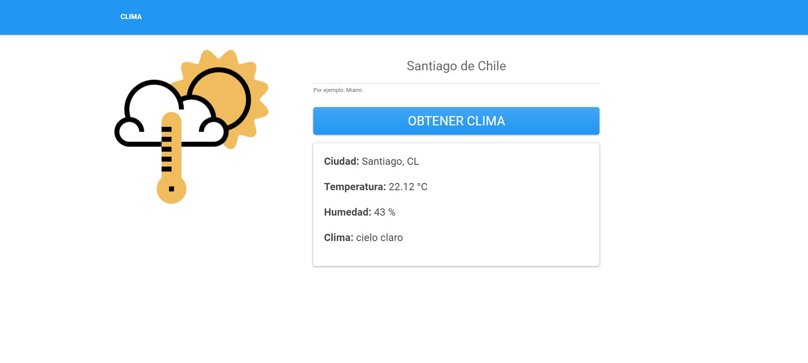

# Angular Clima
App para consultar el Clima de las ciudades del mundo implementado en Angular. La API usada para consultar el clima es [OpenWeather](https://openweathermap.org/).

## Configuración
Ejecuta `ng serve --o` y navega en `http://localhost:4200/` para visualizar el proyecto.

## Vista Previa

